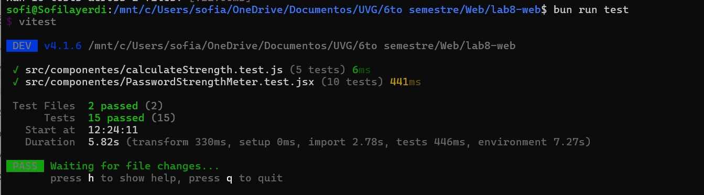

# Password Strength Meter

Proyecto desarrollado con **React + Vite** utilizando **Vitest** y **React Testing Library** para practicar el flujo de desarrollo **TDD (Test Driven Development)**.

## Objetivo del Proyecto

El objetivo principal de este laboratorio es practicar:

- Configuración manual de un proyecto React con Vite.
- Configuración de Vitest y React Testing Library.
- Aplicación del flujo TDD:
  - Red → escribir tests que fallen.
  - Green → implementar hasta que los tests pasen.
  - Refactor → mejorar el código manteniendo tests en verde.
- Separación entre lógica pura y componentes React.
- Testing de componentes utilizando interacción real del usuario.

---

# Tecnologías Utilizadas

- React
- Vite
- Vitest
- React Testing Library
- jsdom
- ESLint
- Bun

---

# Instalación

Clonar el repositorio:

```bash
git clone https://github.com/Sofilayerdi/lab8-web.git
```

Entrar al proyecto:

```bash
cd lab8-web
```

Instalar dependencias:

```bash
bun install
```

---

# Ejecutar el Proyecto

Para correr el proyecto en modo desarrollo:

```bash
bun run dev
```

---

# Ejecutar los Tests

Para correr todos los tests:

```bash
bun run test
```

---

# Ejecutar Linter

Para verificar errores de estilo y lint:

```bash
bun run lint
```


---

# Funcionalidad

El componente `PasswordStrengthMeter` permite evaluar la fortaleza de una contraseña en tiempo real.

## Reglas de Fortaleza

| Condición | Resultado |
|---|---|
| Contraseña vacía | `"vacía"` |
| Menos de 8 caracteres | `"débil"` |
| 8+ caracteres | `"media"` |
| 8+ caracteres con número | `"fuerte"` |
| 8+ caracteres con número y símbolo | `"muy fuerte"` |

---

# Testing

El proyecto incluye:

## Tests Unitarios

Para la función pura:

```plaintext
calculateStrength.js
```

Se validan todos los casos de fortaleza.

---

## Tests del Componente

Para:

```plaintext
PasswordStrengthMeter.jsx
```

Se prueban:

- Renderizado inicial.
- Escritura del usuario.
- Cambios dinámicos de fortaleza.
- Edge cases.
- Accesibilidad.
- Barra de progreso.

---

# Flujo TDD Utilizado

El desarrollo siguió el flujo obligatorio de Test Driven Development:

1. Configuración del proyecto.
2. Escritura de todos los tests antes de implementar.
3. Commit obligatorio con tests fallando.
4. Implementación mínima para hacer pasar los tests.
5. Refactorización manteniendo tests en verde.

El historial de commits refleja este proceso.

- El commit **generacion de tests** contiene los test fallando


- Prueba de test pasando:

---

# Configuración del Proyecto

## Vitest

Configurado utilizando:

- `jsdom`
- `@testing-library/jest-dom`

Archivo:

```plaintext
vite.config.js
```

---

## ESLint

El proyecto incluye configuración de ESLint para React.

Archivo:

```plaintext
eslint.config.js
```

---

# Scripts Disponibles

| Script | Descripción |
|---|---|
| `bun run dev` | Ejecuta Vite en desarrollo |
| `bun run test` | Ejecuta los tests |
| `bun run lint` | Ejecuta ESLint |
| `bun run build` | Genera build de producción |

---

# Requisitos Cumplidos

- Configuración manual de Vite + Vitest + RTL
- Tests escritos antes de implementación
- Separación de lógica y componente
- Uso de React Testing Library
- Uso de `userEvent`
- Edge cases
- Accesibilidad
- Barra de progreso
- ESLint configurado

